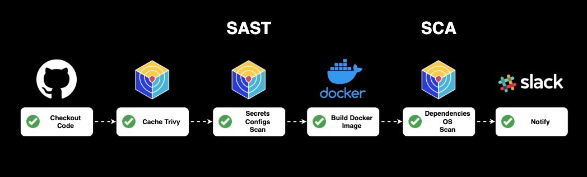

# 🔐 GitSecOps CI/CD PoC

> Elimina secretos, escanea dependencias y duerme tranquilo 💤  
> Prueba de concepto de un pipeline moderno **DevSecOps** centrado en la etapa de **Integración Continua (CI)**.

---

## 📌 Descripción

Este repositorio demuestra cómo construir una **pipeline CI moderna con enfoque DevSecOps**, integrando herramientas de escaneo de seguridad desde el inicio del ciclo de vida del desarrollo.  
La solución se basa en **GitHub Actions**, escaneos con **Trivy**, y buenas prácticas de CI segura para Node.js (Express) con Docker.

🔍 En esta etapa abordamos principalmente:

- 🔒 **SAST** (Static Application Security Testing)
- 🐳 **Docker Image Hardening**
- 📦 **SCA** (Software Composition Analysis)
- 🚨 Notificaciones a Slack

> 🎯 Próximamente se documentará la etapa de **CD** (Continuous Deployment).

---

## 🚀 ¿Qué incluye este repositorio?

| Etapa | Descripción |
|-------|-------------|
| ✅ Checkout del código | Se descarga el repo desde GitHub. |
| ♻️ Cache Trivy | Mejora el tiempo de análisis con caché. |
| 🔍 SAST | Escaneo de secretos y configuraciones inseguras en el código fuente. |
| 🛠 Build Docker | Construcción segura de la imagen Docker. |
| 📦 SCA | Análisis de dependencias y sistema operativo. |
| 🔔 Notificación | Alertas automáticas vía Slack. |

---

## 🛠 Herramientas utilizadas

- [GitHub Actions](https://github.com/features/actions)
- [Trivy by Aqua Security](https://github.com/aquasecurity/trivy)
- [Slack Webhooks](https://api.slack.com/messaging/webhooks)
- Docker
- Node.js (Express)

---

## 🗂 Estructura

